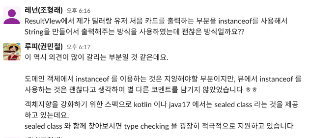

# 1. view에서 instanceof의 사용
- 블래잭게임에서 처음에 딜러의 카드는 한장, 일반 유저의 카드는 두장을 출력해주어야하는 상황에서 ResultView에 다음과 같이 코드를 작성해서 카드를 출력해주었다.
~~~
private static String checkPlayerType(final Player player) {
        if (player instanceof Dealer) {
            return player.getCardsToList().stream()
                    .map(card -> card.getDenominationType() + card.getSuit())
                    .findFirst()
                    .orElseThrow();
        }
        return player.getCardsToList().stream()
                .map(card -> card.getDenominationType() + card.getSuit())
                .collect(Collectors.joining(", "));
}
~~~

- [instasnceof 사용을 지양하자](https://tecoble.techcourse.co.kr/post/2021-04-26-instanceof/)

# 2. 드모르간의 법칙
- [코멘트링크](https://github.com/woowacourse/java-blackjack/pull/340#discussion_r829700025)
- A도 아니고 B도 아니면 ~이다.
- A이거나 B이면 ~가 아니다.
- 후자가 더 자연스럽다.
~~~
public static boolean validateDrawCardAnswer(final String answer) {
    if (!answer.equals(YES) && !answer.equals(NO)) {...}

    if (answer.equals(YES) || answer.equals(NO)) {...}
}
~~~

# 3. 객체에 메시지를 보내자.
- [코멘트링크](https://github.com/woowacourse/java-blackjack/pull/340#discussion_r829697376)
~~~
public double calculateRevenue(BettingMoney bettingMoney) {
    return bettingMoney.getValue() * 1.5;
}
~~~
getter로 값을 빼서 계산하지 말고 객체에 메시지를 보내서 계산한다.
~~~
public class BettingMoney {

    private final int value;

    public double calculateRevenue() {
        return value * 1.5;
    }
}
~~~

# 4. 일급 컬렉션을 사용하여 책임을 적절한 객체로 위임하자.
- [코멘트링크](https://github.com/woowacourse/java-blackjack/pull/340#discussion_r829697598)
- Map<User, BettingMoney>의 일급컬렉션을 만들어서, 유저들과 딜러의 베팅머니 결과를 반환해주는 책임을 위임할 수 있다.